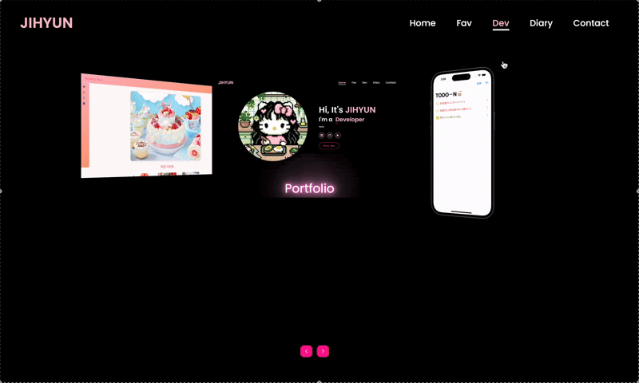
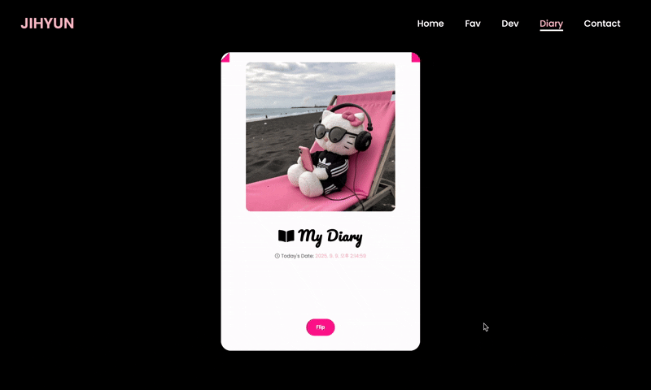
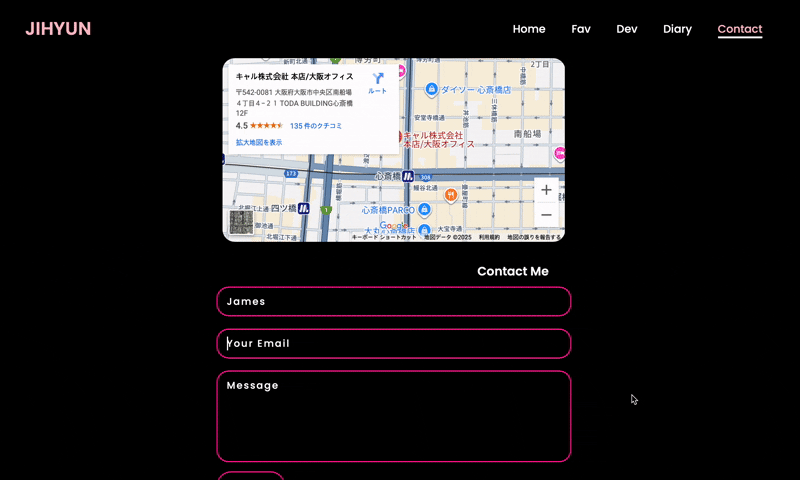

# Portfolio
HTML · CSS · JavaScript

---

  

     
    <b>Main Page</b>
  

  

     
    <b>Favorite Page</b>
  

  

     
    <b>Dev Page</b>
  

  

     
    <b>Diary Page</b>
  

  

     
    <b>Contact Page</b>
  

